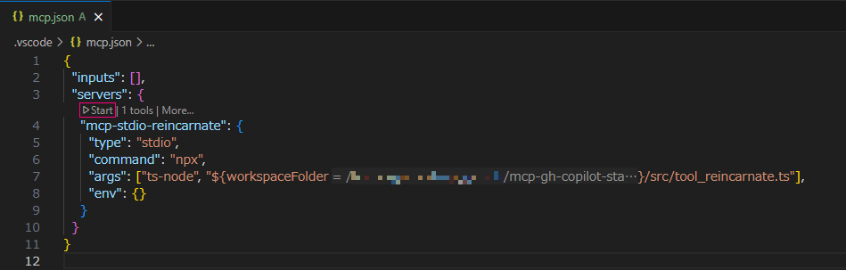
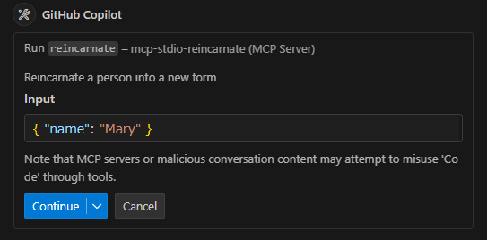
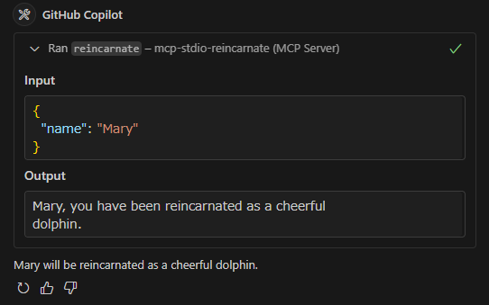

== MCP example using node.js

=== Environment
This example uses the MCP protocol to run a TypeScript program that simulates a reincarnation scenario. The program is executed using Node.js and TypeScript, allowing for dynamic interaction with the MCP server.

* Windows 11
** WSL2
*** Ubuntu 22.04.2 LTS
* Node.js: v18.18.0
* VS-Code
** Chat 〉 MCP: Enabled (Preview)

=== Installation

1. Install node using n package manager:
+
[source,shell]
----
sudo n lts
----

2. Install typescript package locally:
+
[source,shell]
----
npm install --save-dev ts-node typescript
----

=== To run mcp server write mcp.json file

Create a `.vscode/mcp.json` file in the root of your project with the following content:

[source,json]
..vscode/mcp.json
----
{
  "inputs": [],
  "servers": {
    "mcp-stdio-reincarnate": {
      "type": "stdio",
      "command": "npx",
      "args": ["ts-node", "${workspaceFolder}/src/tool_reincarnate.ts"],
      "env": {}
    }
  }
}
----

=== Example

1. Open `.vscode/mcp.json`, and start mcp server:
+

2. Open the settings and ask the following question:
+
[source,plaintext]
.Asking the question
----
Please tell me where Mary will be reincarnated.
----

3. Click the "Continue" button to run the code:
+

4. The answer will be displayed in the chat window:
+

